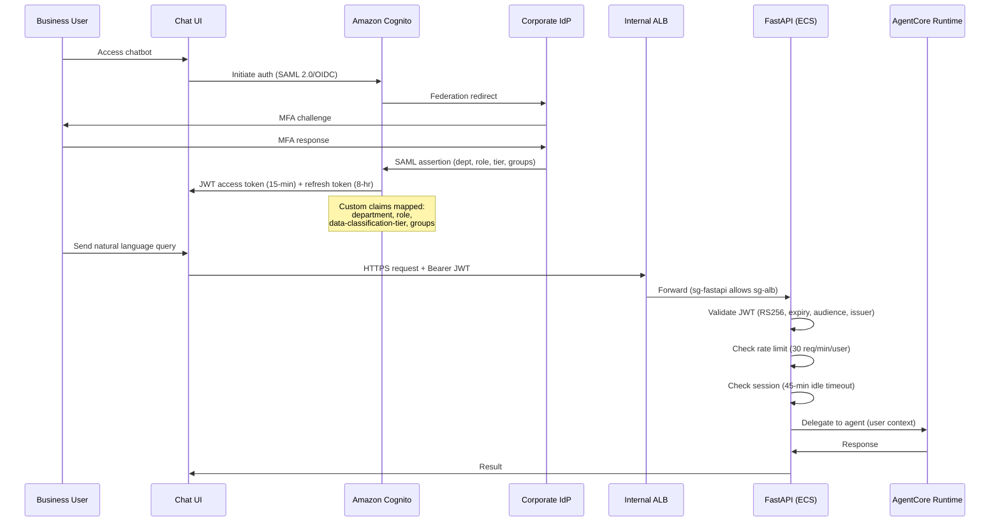
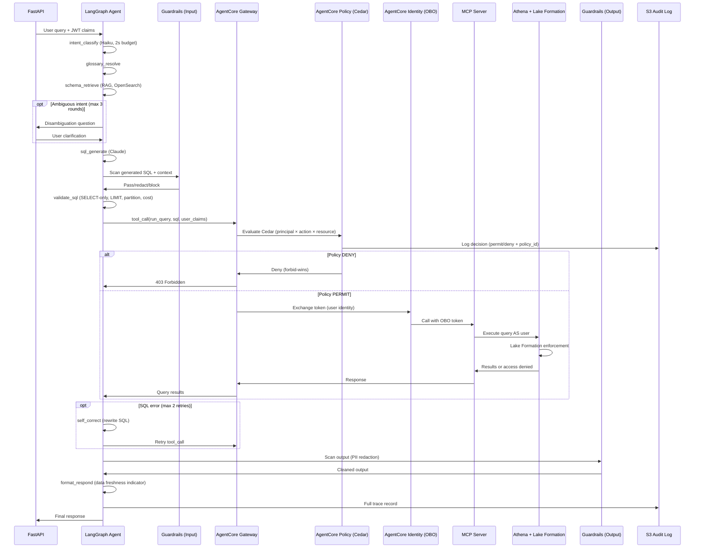
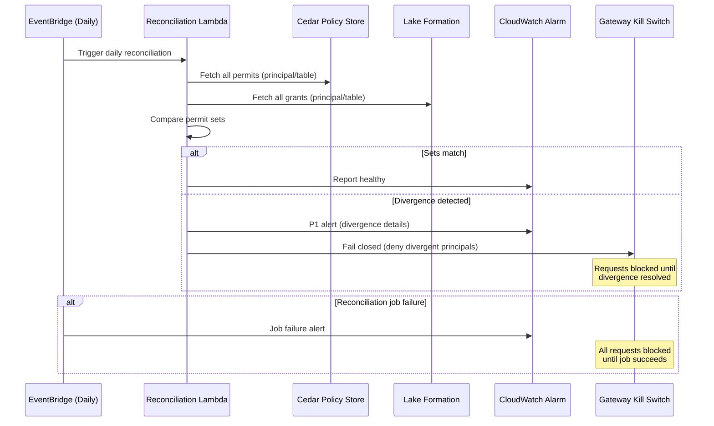
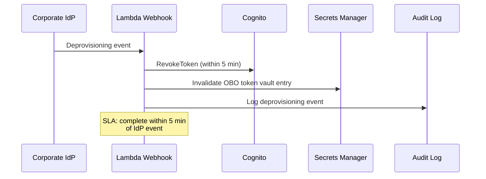
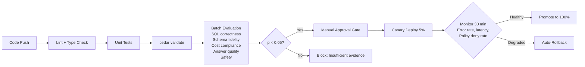

# Design Document: Chatbot Security Architecture

## Overview

This document defines the security architecture for a production chatbot enabling business users at a Tier-1 bank to query several hundred Amazon Athena tables in natural language. The system implements defense-in-depth across authentication, authorization, content safety, and audit — with no single control serving as the sole barrier to unauthorized access.

The architecture separates concerns into distinct layers: a thin FastAPI session/auth boundary, an AgentCore-hosted LangGraph orchestration agent with structurally bounded control flow, a two-layer authorization model (AgentCore Policy + Lake Formation), and an immutable audit trail independent of operational telemetry. Every design decision traces to one or more of six security principles: defense in depth, default-deny, least privilege, separation of control planes, deterministic over probabilistic, and assume breach.

The project structure follows `chatbot/{api, agent, mcp_server, policies, infra, tests, scripts}/` with `pyproject.toml` for Python dependency management and AWS CDK (TypeScript) for infrastructure-as-code.

## Design Principles

| ID | Principle | Enforcement Mechanism |
|----|-----------|----------------------|
| P1 | Defense in depth | Two-layer auth (Policy + Lake Formation), Guardrails at model AND gateway |
| P2 | Default-deny | Cedar forbid-wins semantics, PrivateLink-only networking, no "allow all" IAM |
| P3 | Least privilege | OBO tokens scoped per-user per-session, read-only workgroup, 15-min JWTs |
| P4 | Separation of control planes | Policy at Gateway (not inside agent), Lake Formation at Athena (not in app code) |
| P5 | Deterministic over probabilistic | Cedar for authorization, Guardrails only for content safety |
| P6 | Assume breach | Reconciliation detects drift, immutable audit survives component failure, kill switch |

## Architecture

### High-Level System Architecture

```mermaid
graph TD
    subgraph Corporate Network
        UI[Chat UI - Internal Web App]
    end

    subgraph AWS VPC - Private Subnets
        ALB[Internal ALB<br/>HTTPS 443, ACM cert<br/>sg-alb: corporate CIDR only]
        
        subgraph ECS Fargate
            API[FastAPI<br/>JWT validation, rate limit<br/>circuit breaker, session mgmt]
        end

        subgraph AgentCore Runtime
            AGENT[LangGraph Agent<br/>Explicit graph, bounded loops<br/>1 vCPU, 2GB memory]
            MEMORY[AgentCore Memory<br/>Session-scoped state]
        end

        subgraph AgentCore Gateway
            GW[Gateway<br/>Semantic tool search<br/>Policy attachment point]
            POLICY[AgentCore Policy<br/>Cedar, default-deny<br/>forbid-wins]
            IDENTITY[AgentCore Identity<br/>OBO token exchange<br/>Per-user federated identity]
        end

        subgraph Tool Layer - MCP Server
            MCP[MCP Server<br/>list_tables, get_schema<br/>estimate_cost, run_query]
        end

        subgraph Data Layer
            ATHENA[Amazon Athena<br/>chatbot-readonly workgroup<br/>bytes-scanned limit]
            LF[Lake Formation<br/>Table/column/row/cell<br/>permissions]
            GLUE[AWS Glue Catalog<br/>Table metadata]
            S3DATA[S3 Data Lake<br/>Parquet/ORC]
        end

        subgraph Vector Store
            OS[OpenSearch Serverless<br/>VPC-only, vector type<br/>Schema + glossary embeddings]
        end

        subgraph Safety Layer
            GR[Bedrock Guardrails<br/>Standard tier<br/>Input + Output scanning]
        end

        subgraph Audit & Observability
            OBS[AgentCore Observability<br/>OpenTelemetry tracing]
            AUDIT[S3 Object Lock<br/>Compliance mode, 7-year<br/>Cross-region replication]
            CW[CloudWatch Dashboards]
            SIEM[Bank SIEM<br/>Splunk/QRadar]
        end
    end

    subgraph Identity
        COGNITO[Amazon Cognito<br/>SAML 2.0/OIDC federation]
        IDP[Corporate IdP<br/>MFA enforced]
    end

    UI -->|HTTPS 443| ALB
    ALB -->|sg-fastapi: from sg-alb| API
    API -->|JWT validated| AGENT
    AGENT -->|All tool calls| GW
    GW -->|Cedar eval| POLICY
    GW -->|OBO exchange| IDENTITY
    GW -->|Route| MCP
    MCP -->|User identity| ATHENA
    ATHENA -->|Enforced| LF
    ATHENA -->|Catalog| GLUE
    ATHENA -->|Query| S3DATA
    AGENT -->|RAG retrieval| OS
    AGENT -->|Every model call| GR
    AGENT -->|Traces| OBS
    OBS -->|Dashboards| CW
    OBS -->|Subscription filters| SIEM
    API -->|Auth decisions| AUDIT
    GW -->|Policy decisions| AUDIT
    COGNITO -->|Federation| IDP
    UI -->|Auth flow| COGNITO

### Network Security Architecture

```mermaid
graph LR
    subgraph Corporate Network
        CLIENT[Business Users]
    end

    subgraph sg-alb[Security Group: sg-alb]
        ALB[Internal ALB<br/>443 from Corporate CIDR]
    end

    subgraph sg-fastapi[Security Group: sg-fastapi]
        FASTAPI[FastAPI ECS Tasks<br/>8000 from sg-alb only]
    end

    subgraph sg-vpce[Security Group: sg-vpce]
        VPCE_BEDROCK[VPC Endpoint: Bedrock Runtime]
        VPCE_AGENTCORE[VPC Endpoint: AgentCore]
        VPCE_ATHENA[VPC Endpoint: Athena]
        VPCE_GLUE[VPC Endpoint: Glue]
        VPCE_S3[VPC Endpoint: S3]
        VPCE_SM[VPC Endpoint: Secrets Manager]
        VPCE_KMS[VPC Endpoint: KMS]
        VPCE_CW[VPC Endpoint: CloudWatch]
        VPCE_COGNITO[VPC Endpoint: Cognito]
        VPCE_OS[VPC Endpoint: OpenSearch]
    end

    CLIENT -->|HTTPS 443| ALB
    ALB -->|Port 8000| FASTAPI
    FASTAPI -->|443 PrivateLink| VPCE_BEDROCK
    FASTAPI -->|443 PrivateLink| VPCE_AGENTCORE
    FASTAPI -->|443 PrivateLink| VPCE_COGNITO
    VPCE_AGENTCORE -->|443 PrivateLink| VPCE_ATHENA
    VPCE_AGENTCORE -->|443 PrivateLink| VPCE_GLUE
    VPCE_AGENTCORE -->|443 PrivateLink| VPCE_S3
    VPCE_AGENTCORE -->|443 PrivateLink| VPCE_SM
    VPCE_AGENTCORE -->|443 PrivateLink| VPCE_KMS
    VPCE_AGENTCORE -->|443 PrivateLink| VPCE_CW
    VPCE_AGENTCORE -->|443 PrivateLink| VPCE_OS
```

**Key constraint**: ALL traffic via VPC PrivateLink — no public internet path for agent-to-tool, tool-to-data, or agent-to-model communication. TLS 1.2+ enforced; TLS 1.0/1.1 rejected.

## Sequence Diagrams

### Authentication & Session Establishment



### Agent Orchestration & Tool Execution Flow



### Reconciliation Flow



### User Deprovisioning Flow



## Components and Interfaces

### Component 1: FastAPI Session/Auth Layer (`chatbot/api/`)

**Purpose**: Thin, deterministic boundary between corporate network and AgentCore. Handles JWT validation, rate limiting, session management, and circuit breaking. Does NOT implement orchestration logic.

**Interface**:

```python
from pydantic import BaseModel
from enum import Enum

class UserClaims(BaseModel):
    sub: str                          # Cognito user ID
    department: str                   # Mapped from SAML assertion
    role: str                         # e.g., "analyst", "manager"
    data_classification_tier: str     # e.g., "confidential", "internal"
    groups: list[str]                 # IdP group memberships
    session_id: str                   # Unique session identifier
    exp: int                          # Token expiry (15-min max)

class ChatRequest(BaseModel):
    message: str
    session_id: str
    conversation_id: str | None = None

class ChatResponse(BaseModel):
    answer: str
    sql_generated: str | None = None
    data_freshness: str | None = None  # "Data current as of..."
    row_count: int | None = None
    cost_estimate_bytes: int | None = None
    warnings: list[str] = []

class ErrorResponse(BaseModel):
    error_type: str        # auth_denied, cost_exceeded, sql_failed, rate_limited, out_of_scope
    message: str           # User-facing actionable guidance
    trace_id: str
    retry_after: int | None = None  # For rate limiting
```

**Responsibilities**:
- JWT validation (RS256 signature, expiry, audience, issuer checks)
- Rate limiting (30 requests/min per user, token bucket)
- Circuit breaker (fail to 503 when AgentCore Runtime unavailable)
- Session timeout enforcement (45-min idle)
- Request correlation (trace_id generation)
- No `admin_initiate_auth` — admins cannot impersonate users

### Component 2: LangGraph Agent (`chatbot/agent/`)

**Purpose**: Orchestration logic as an explicit, auditable state graph. Every path visible to security architects. Bounded loops enforced structurally in graph definition.

**Interface**:

```python
from dataclasses import dataclass
from typing import Literal
from langgraph.graph import StateGraph, END

@dataclass
class AgentState:
    user_claims: UserClaims
    user_message: str
    intent: str | None = None
    resolved_terms: dict[str, str] | None = None
    retrieved_schemas: list[dict] | None = None
    disambiguation_rounds: int = 0    # Max 3
    generated_sql: str | None = None
    sql_valid: bool = False
    self_correction_attempts: int = 0  # Max 2
    query_results: dict | None = None
    guardrails_findings: list[str] | None = None
    final_response: str | None = None
    error: str | None = None

class AgentGraph:
    """LangGraph agent with explicit nodes and bounded conditional edges."""

    NODES = [
        "intent_classify",
        "glossary_resolve",
        "schema_retrieve",
        "disambiguate",
        "sql_generate",
        "validate_sql",
        "tool_call",
        "self_correct",
        "output_scan",
        "format_respond",
    ]

    MAX_DISAMBIGUATION_ROUNDS: int = 3
    MAX_SELF_CORRECTION_RETRIES: int = 2

    def build_graph(self) -> StateGraph:
        """Construct the agent graph with structurally bounded loops."""
        ...

    def should_disambiguate(self, state: AgentState) -> Literal["disambiguate", "sql_generate"]:
        """Conditional edge: disambiguate if intent unclear AND rounds < 3."""
        ...

    def should_self_correct(self, state: AgentState) -> Literal["self_correct", "output_scan"]:
        """Conditional edge: retry SQL if error AND attempts < 2."""
        ...
```

**Responsibilities**:
- Explicit graph definition (all paths auditable)
- Structural loop bounds (not runtime counters — graph edges enforce limits)
- Schema retrieval filtered to user-authorized tables only
- Delegation of all tool calls to AgentCore Gateway (never direct)
- Integration with AgentCore Memory for session state

### Component 3: MCP Server (`chatbot/mcp_server/`)

**Purpose**: Tool implementation layer exposing Athena operations via Model Context Protocol. All requests arrive through AgentCore Gateway (never direct invocation). Input validation enforces SQL safety before execution.

**Interface**:

```python
from pydantic import BaseModel

class TableInfo(BaseModel):
    database: str
    table_name: str
    description: str
    columns: list["ColumnInfo"]
    partition_keys: list[str]
    last_updated: str  # ISO 8601

class ColumnInfo(BaseModel):
    name: str
    data_type: str
    description: str
    is_pii: bool
    classification: str  # public, internal, confidential, restricted

class CostEstimate(BaseModel):
    estimated_bytes_scanned: int
    estimated_cost_usd: float
    exceeds_threshold: bool  # True if > 10 GB
    suggestion: str | None = None  # Partition filter / column reduction

class QueryResult(BaseModel):
    columns: list[str]
    rows: list[dict]
    row_count: int
    bytes_scanned: int
    execution_time_ms: int
    data_freshness: str  # From Glue Catalog partition timestamps

class MCPTools:
    """MCP server tools — all routed through AgentCore Gateway."""

    async def list_tables(self, user_claims: UserClaims) -> list[TableInfo]:
        """List tables the authenticated user is authorized to access."""
        ...

    async def get_schema(self, database: str, table: str, user_claims: UserClaims) -> TableInfo:
        """Get detailed schema for a specific table (authorized check)."""
        ...

    async def estimate_cost(self, sql: str, user_claims: UserClaims) -> CostEstimate:
        """Dry-run cost estimate before execution."""
        ...

    async def run_query(self, sql: str, user_claims: UserClaims) -> QueryResult:
        """Execute validated SQL via Athena as the authenticated user."""
        ...
```

**Responsibilities**:
- Input validation: reject non-SELECT statements
- LIMIT injection (default 10,000 rows)
- Partition filter enforcement on partitioned tables
- Reject `SELECT *` on tables with >50 columns
- Cost estimate check (block if >10 GB scan estimate)
- Reject full table scans on tables >1 TB without elevated entitlement
- All queries via dedicated read-only workgroup (`chatbot-readonly`)

### Component 4: AgentCore Policy (Cedar) (`chatbot/policies/`)

**Purpose**: Deterministic, formal authorization at the Gateway boundary. Evaluates structured metadata only (principal × action × resource). Never sees prompt content — cannot be bypassed by jailbroken prompts.

**Interface**:

```python
# Cedar policy evaluation (conceptual — actual evaluation by AgentCore)
@dataclass
class PolicyRequest:
    principal: str          # OAuth sub + claims
    action: str             # Tool name: "run_query", "list_tables", etc.
    resource: str           # "database/table" identifier
    context: dict           # ABAC claims: department, role, tier, groups

@dataclass
class PolicyDecision:
    decision: Literal["ALLOW", "DENY"]
    determining_policies: list[str]  # Policy IDs that contributed
    policy_version: str
    evaluation_time_ms: int

# Cedar policy structure
CEDAR_POLICY_EXAMPLE = """
// Policy: Analysts can query tables in their department's databases
permit(
    principal,
    action == Action::"run_query",
    resource
) when {
    principal.role == "analyst" &&
    resource.database in principal.department_databases &&
    resource.classification_tier <= principal.data_classification_tier
};

// Forbid: No one accesses PCI databases via chatbot (defense in depth)
forbid(
    principal,
    action,
    resource
) when {
    resource.database in ["pci_cardholder", "pci_transactions"]
};
"""
```

**Responsibilities**:
- Default-deny: no access without explicit permit
- Forbid-wins semantics: forbid always overrides permit
- ABAC evaluation using OAuth claims (department, role, tier, groups)
- Natural-language policy authoring with mandatory human review
- `cedar validate` in CI/CD pipeline
- Segregation of duties: author ≠ approver

### Component 5: AgentCore Identity — OBO Token Exchange

**Purpose**: Ensures every Athena query executes as the authenticated end user's federated identity, never a shared service role. Enables Lake Formation per-user grants to function correctly.

**Interface**:

```python
@dataclass
class OBOTokenRequest:
    workload_identity: str    # AgentCore Runtime identity
    user_id: str              # Cognito sub (end user)
    target_service: str       # "athena", "glue", etc.
    scopes: list[str]         # Requested permissions

@dataclass
class OBOToken:
    access_token: str         # Scoped to user + session
    expires_in: int           # Short-lived
    target_service: str
    user_identity: str        # Federated identity ARN

class IdentityService:
    """AgentCore Identity OBO token management."""

    async def exchange_token(self, request: OBOTokenRequest) -> OBOToken:
        """Exchange workload identity for user-scoped OBO token."""
        ...

    async def revoke_token(self, user_id: str) -> None:
        """Revoke all OBO tokens for a deprovisioned user."""
        ...
```

**Responsibilities**:
- Token vault keyed to (workload_identity, user_id)
- Secrets stored in Secrets Manager with 90-day rotation
- Token scoped per-user per-session
- Revocation within 5 minutes of IdP deprovisioning event

### Component 6: Bedrock Guardrails (Content Safety)

**Purpose**: Probabilistic content safety layer on every model call (input AND output). Handles prompt injection detection, jailbreak detection, PII redaction, denied topics, and content filtering. Architecturally separate from authorization (Policy handles authorization).

**Interface**:

```python
from enum import Enum

class GuardrailAction(Enum):
    PASS = "pass"
    REDACT = "redact"
    BLOCK = "block"

class PIIType(Enum):
    """All 31 PII entity types — ANONYMIZE action."""
    NAME = "NAME"
    EMAIL = "EMAIL"
    PHONE = "PHONE"
    SSN = "SSN"
    CREDIT_CARD = "CREDIT_CARD"
    # ... all 31 types

class GuardrailResult(BaseModel):
    action: GuardrailAction
    findings: list[str]
    redacted_content: str | None = None
    blocked_reason: str | None = None
    prompt_injection_detected: bool
    jailbreak_detected: bool
    pii_entities_found: list[str]

class ContentFilter(BaseModel):
    """All content filter categories set to HIGH threshold."""
    hate: str = "HIGH"
    violence: str = "HIGH"
    sexual: str = "HIGH"
    insults: str = "HIGH"
    misconduct: str = "HIGH"

class GuardrailsConfig:
    tier: str = "STANDARD"
    scan_input: bool = True
    scan_output: bool = True
    pii_action: str = "ANONYMIZE"
    content_filters: ContentFilter = ContentFilter()
    denied_topics: list[str] = []  # Configured per deployment
```

**Responsibilities**:
- Scan EVERY model call (not selective)
- Input scanning: prompt injection, jailbreak, PII in user message
- Output scanning: PII in query results + model narrative
- PII redaction unless user role permits viewing that PII category
- Denied topics enforcement (off-topic queries)
- Content filter at HIGH for all categories

### Component 7: Audit & Observability

**Purpose**: Immutable audit trail independent of operational telemetry. Survives component failure. Meets 7-year regulatory retention.

**Interface**:

```python
@dataclass
class AuditRecord:
    timestamp: str                    # ISO 8601
    trace_id: str                     # OpenTelemetry correlation
    session_id: str
    principal: str                    # User identity
    original_question: str
    generated_sql: str | None
    policy_decision: str              # permit/deny
    policy_id: str                    # Determining policy
    policy_version: str
    lake_formation_outcome: str       # allowed/denied
    estimated_cost_bytes: int | None
    actual_cost_bytes: int | None
    row_count: int | None
    guardrails_findings: list[str]
    error: str | None

class AuditStore:
    """S3 Object Lock (Compliance mode, 7-year retention)."""

    async def write_record(self, record: AuditRecord) -> None:
        """Write immutable audit record. Cross-region replicated."""
        ...

    async def query_by_principal(self, principal: str, date_range: tuple) -> list[AuditRecord]:
        """Query for DSAR response / investigation."""
        ...
```

**Responsibilities**:
- S3 Object Lock in Compliance mode (cannot be deleted, even by root)
- 7-year retention period
- Cross-region replication (RPO=0 for audit)
- Record includes full context for regulatory queries
- Supports GDPR/UK GDPR DSAR response
- Independent of AgentCore Observability operational retention

## Data Models

### Session State Model

```python
@dataclass
class SessionState:
    session_id: str
    user_id: str
    created_at: str          # ISO 8601
    last_activity: str       # For 45-min idle timeout
    conversation_history: list[dict]
    authorized_schemas: list[str]  # Pre-computed per user
    obo_token_ref: str       # Reference to token vault entry

    def is_expired(self) -> bool:
        """Session expired if idle > 45 minutes."""
        ...
```

**Validation Rules**:
- `session_id` must be UUID v4
- `last_activity` must be within 45 minutes of current time
- `authorized_schemas` populated from Lake Formation grants at session start
- Session state stored in AgentCore Memory (session-scoped, auto-cleaned)

### Cedar Policy Model

```python
@dataclass
class CedarPrincipal:
    entity_type: str = "User"
    entity_id: str = ""       # Cognito sub
    department: str = ""
    role: str = ""
    data_classification_tier: str = ""
    groups: list[str] = None
    department_databases: list[str] = None

@dataclass
class CedarResource:
    entity_type: str = "Table"
    entity_id: str = ""       # "database/table"
    database: str = ""
    classification_tier: str = ""
    is_partitioned: bool = False
    estimated_size_gb: float = 0.0

@dataclass  
class CedarAction:
    action_type: str = ""     # "run_query", "list_tables", "get_schema", "estimate_cost"
```

**Validation Rules**:
- Principal claims sourced ONLY from JWT (no user-supplied overrides)
- Resource metadata sourced from Glue Catalog (authoritative)
- Classification tier hierarchy: public < internal < confidential < restricted
- User can access resources at or below their tier level

### Vector Store Schema (OpenSearch Serverless)

```python
@dataclass
class SchemaEmbedding:
    embedding_id: str
    database: str
    table_name: str
    column_name: str | None     # None for table-level
    description: str            # Natural language description
    business_glossary_terms: list[str]
    synonyms: list[str]
    data_type: str | None
    embedding_vector: list[float]  # Titan Embeddings
    last_indexed: str           # Must be within 1 hour of Glue change
    lake_formation_tags: dict   # For filtering by user authorization
```

**Validation Rules**:
- Re-index within 1 hour of Glue Catalog changes (EventBridge trigger)
- Only schemas matching user's Lake Formation grants included in retrieval
- Vector type collection (VPC-only access)
- Embeddings generated by Bedrock Titan Embeddings model

## Key Functions with Formal Specifications

### Function 1: `validate_jwt(token: str) -> UserClaims`

```python
async def validate_jwt(token: str) -> UserClaims:
    """Validate JWT and extract user claims."""
    ...
```

**Preconditions:**
- `token` is a non-empty string
- Cognito JWKS endpoint is reachable (via PrivateLink)
- Token signing key (RS256) is cached or fetchable

**Postconditions:**
- Returns `UserClaims` if and only if: RS256 signature valid, `exp` > now, `aud` matches configured audience, `iss` matches Cognito issuer URL
- Raises `AuthenticationError` with specific reason if any check fails
- No side effects (pure validation)
- Latency: ≤15ms (cached JWKS)

**Loop Invariants:** N/A (no loops)

### Function 2: `evaluate_policy(request: PolicyRequest) -> PolicyDecision`

```python
async def evaluate_policy(request: PolicyRequest) -> PolicyDecision:
    """Evaluate Cedar policy — deterministic, default-deny, forbid-wins."""
    ...
```

**Preconditions:**
- `request.principal` derived from validated JWT (not user-supplied)
- `request.resource` resolved from Glue Catalog (authoritative)
- Cedar policy store is loaded and valid (passes `cedar validate`)

**Postconditions:**
- Returns DENY if no matching permit exists (default-deny)
- Returns DENY if any matching forbid exists (forbid-wins, regardless of permits)
- Returns ALLOW only if: explicit permit matches AND no forbid matches
- Decision is deterministic (same input → same output, always)
- Decision logged to audit store before returning
- Evaluation time ≤30ms

**Loop Invariants:** N/A

### Function 3: `validate_sql(sql: str, user_claims: UserClaims) -> ValidationResult`

```python
@dataclass
class ValidationResult:
    valid: bool
    modified_sql: str | None    # With LIMIT injected
    rejection_reason: str | None
    estimated_bytes: int | None

async def validate_sql(sql: str, user_claims: UserClaims) -> ValidationResult:
    """Validate and sanitize SQL before execution."""
    ...
```

**Preconditions:**
- `sql` is a non-empty string generated by the LLM
- `user_claims` are from a validated JWT
- Glue Catalog metadata available for referenced tables

**Postconditions:**
- `valid=False` if: statement is not SELECT, references unauthorized tables, missing partition filter on partitioned table, uses `SELECT *` on table with >50 columns, estimated scan >10 GB (without elevated entitlement), full table scan on >1 TB table
- `valid=True` implies: `modified_sql` has LIMIT injected (default 10,000), all referenced tables are in user's authorized set
- No SQL execution occurs during validation (AST parsing + dry-run only)
- Pure function (no side effects beyond cost estimation API call)

**Loop Invariants:**
- For table reference iteration: all previously checked tables were authorized

### Function 4: `reconcile_permissions() -> ReconciliationResult`

```python
@dataclass
class ReconciliationResult:
    status: Literal["healthy", "divergent", "error"]
    divergences: list[dict]     # principal/table pairs that differ
    cedar_permits: int          # Total Cedar permits evaluated
    lf_grants: int              # Total Lake Formation grants evaluated
    execution_time_s: float

async def reconcile_permissions() -> ReconciliationResult:
    """Daily reconciliation: Cedar permits vs Lake Formation grants."""
    ...
```

**Preconditions:**
- Cedar policy store accessible and valid
- Lake Formation API accessible
- All principal identities resolvable

**Postconditions:**
- If `status="healthy"`: for every (principal, table) pair, Cedar permit exists ↔ Lake Formation grant exists
- If `status="divergent"`: `divergences` contains all mismatched pairs, P1 alert triggered, affected principals fail-closed
- If `status="error"`: reconciliation could not complete, all requests blocked until resolved (assume breach)
- Result logged to audit store regardless of outcome

**Loop Invariants:**
- For each (principal, table) comparison: all prior comparisons recorded in result
- Divergence count monotonically non-decreasing during iteration

## Algorithmic Pseudocode

### Main Agent Orchestration Algorithm

```python
async def execute_agent_graph(state: AgentState) -> AgentState:
    """
    Main orchestration algorithm — LangGraph explicit graph execution.
    All paths auditable. Loops structurally bounded.
    """
    # ASSERT: user_claims from validated JWT
    assert state.user_claims is not None
    assert state.user_claims.exp > current_time()

    # Step 1: Intent Classification (Haiku for speed, 2s budget)
    state.intent = await intent_classify(state.user_message, model="claude-haiku")
    # ASSERT: intent is one of known categories
    assert state.intent in VALID_INTENTS

    # Step 2: Business Glossary Resolution
    state.resolved_terms = await glossary_resolve(state.user_message, state.intent)

    # Step 3: Schema Retrieval (RAG, filtered by user authorization)
    authorized_schemas = await get_user_authorized_schemas(state.user_claims)
    state.retrieved_schemas = await schema_retrieve(
        query=state.user_message,
        filter_schemas=authorized_schemas  # Only show what user can access
    )

    # Step 4: Disambiguation (conditional, structurally bounded at 3 rounds)
    while needs_disambiguation(state) and state.disambiguation_rounds < 3:
        # LOOP INVARIANT: disambiguation_rounds < MAX_DISAMBIGUATION_ROUNDS
        clarification = await disambiguate(state)
        user_response = await request_user_input(clarification)
        state.user_message = user_response
        state.disambiguation_rounds += 1
    # ASSERT: either intent is clear OR max rounds exhausted

    # Step 5: SQL Generation
    state.generated_sql = await sql_generate(state)

    # Step 6: Guardrails Input Scan
    guardrails_result = await scan_with_guardrails(
        content=state.generated_sql,
        direction="INPUT"
    )
    if guardrails_result.action == GuardrailAction.BLOCK:
        return state_with_error(state, "Content blocked by safety filter")

    # Step 7: SQL Validation (deterministic checks)
    validation = await validate_sql(state.generated_sql, state.user_claims)
    if not validation.valid:
        return state_with_error(state, validation.rejection_reason)
    state.generated_sql = validation.modified_sql  # LIMIT injected

    # Step 8: Tool Call via Gateway (Policy + OBO)
    try:
        state.query_results = await execute_via_gateway(
            tool="run_query",
            sql=state.generated_sql,
            user_claims=state.user_claims
        )
    except PolicyDenyError as e:
        return state_with_error(state, f"Access denied: {e.policy_id}")
    except AthenaAccessDenied as e:
        return state_with_error(state, "Lake Formation: insufficient permissions")
    except SQLExecutionError as e:
        # Step 9: Self-correction (conditional, max 2 retries)
        while state.self_correction_attempts < 2:
            # LOOP INVARIANT: self_correction_attempts < MAX_RETRIES
            state.generated_sql = await self_correct(state, error=str(e))
            state.self_correction_attempts += 1
            try:
                state.query_results = await execute_via_gateway(
                    tool="run_query",
                    sql=state.generated_sql,
                    user_claims=state.user_claims
                )
                break  # Success
            except SQLExecutionError as retry_error:
                e = retry_error
                continue
        else:
            return state_with_error(state, f"SQL failed after {state.self_correction_attempts} retries")

    # Step 10: Output Scan (PII redaction)
    output_scan = await scan_with_guardrails(
        content=format_results(state.query_results),
        direction="OUTPUT"
    )
    if output_scan.pii_entities_found and not user_can_view_pii(state.user_claims):
        state.query_results = apply_redaction(state.query_results, output_scan)

    # Step 11: Format Response (include data freshness)
    state.final_response = await format_respond(state)

    # ASSERT: response generated, all invariants maintained
    assert state.final_response is not None
    assert state.disambiguation_rounds <= 3
    assert state.self_correction_attempts <= 2

    # Write audit record
    await audit_store.write_record(build_audit_record(state))

    return state
```

### SQL Validation Algorithm

```python
async def validate_sql(sql: str, user_claims: UserClaims) -> ValidationResult:
    """
    Deterministic SQL validation — enforces safety constraints before execution.
    
    PRECONDITION: sql is LLM-generated string, user_claims from validated JWT
    POSTCONDITION: valid=True only if ALL safety checks pass
    """
    # Parse SQL AST
    try:
        ast = parse_sql(sql)
    except ParseError:
        return ValidationResult(valid=False, rejection_reason="Invalid SQL syntax")

    # Check 1: SELECT-only allowlist
    if ast.statement_type != "SELECT":
        return ValidationResult(valid=False, rejection_reason="Only SELECT statements permitted")

    # Check 2: Extract referenced tables
    referenced_tables = extract_table_references(ast)
    authorized_tables = get_authorized_tables(user_claims)
    
    # LOOP INVARIANT: all previously checked tables were in authorized set
    for table in referenced_tables:
        if table not in authorized_tables:
            return ValidationResult(
                valid=False,
                rejection_reason=f"Unauthorized table: {table}"
            )

    # Check 3: Partition filter required on partitioned tables
    for table in referenced_tables:
        metadata = await get_table_metadata(table)
        if metadata.partition_keys and not has_partition_filter(ast, table, metadata.partition_keys):
            return ValidationResult(
                valid=False,
                rejection_reason=f"Partition filter required on {table}"
            )

    # Check 4: Reject SELECT * on wide tables
    if ast.has_select_star:
        for table in referenced_tables:
            metadata = await get_table_metadata(table)
            if len(metadata.columns) > 50:
                return ValidationResult(
                    valid=False,
                    rejection_reason=f"SELECT * not allowed on {table} ({len(metadata.columns)} columns)"
                )

    # Check 5: Cost estimate
    cost = await estimate_query_cost(sql)
    if cost.estimated_bytes_scanned > 10 * GB:
        if "elevated_cost" not in user_claims.groups:
            return ValidationResult(
                valid=False,
                rejection_reason=f"Estimated scan {cost.estimated_bytes_scanned / GB:.1f} GB exceeds 10 GB limit",
                estimated_bytes=cost.estimated_bytes_scanned
            )

    # Check 6: Full table scan on large tables
    for table in referenced_tables:
        metadata = await get_table_metadata(table)
        if metadata.estimated_size_gb > 1000 and is_full_table_scan(ast, table):
            if "elevated_cost" not in user_claims.groups:
                return ValidationResult(
                    valid=False,
                    rejection_reason=f"Full table scan on {table} (>{metadata.estimated_size_gb:.0f} GB) requires elevated entitlement"
                )

    # Inject LIMIT if not present
    modified_sql = inject_limit(ast, default_limit=10000)

    return ValidationResult(
        valid=True,
        modified_sql=modified_sql,
        estimated_bytes=cost.estimated_bytes_scanned
    )
```

### Reconciliation Algorithm

```python
async def reconcile_permissions() -> ReconciliationResult:
    """
    Daily reconciliation: compare Cedar permits against Lake Formation grants.
    Divergence triggers P1 alert + fail-closed.
    
    PRECONDITION: Cedar store and Lake Formation API accessible
    POSTCONDITION: divergences reported, affected principals blocked if any found
    """
    divergences = []
    start_time = time.time()

    try:
        # Fetch all Cedar permits (principal/table pairs)
        cedar_permits = await fetch_cedar_permits()  # Set of (principal, table)
        
        # Fetch all Lake Formation grants (principal/table pairs)  
        lf_grants = await fetch_lake_formation_grants()  # Set of (principal, table)

        # Compare: Cedar permits without corresponding LF grant
        # LOOP INVARIANT: divergences contains all mismatches found so far
        cedar_without_lf = cedar_permits - lf_grants
        for principal, table in cedar_without_lf:
            divergences.append({
                "principal": principal,
                "table": table,
                "type": "cedar_permit_without_lf_grant"
            })

        # Compare: LF grants without corresponding Cedar permit
        lf_without_cedar = lf_grants - cedar_permits
        for principal, table in lf_without_cedar:
            divergences.append({
                "principal": principal,
                "table": table,
                "type": "lf_grant_without_cedar_permit"
            })

        if divergences:
            # P1 Alert
            await trigger_p1_alert(divergences)
            # Fail closed: deny requests for divergent principals
            affected_principals = {d["principal"] for d in divergences}
            await block_principals(affected_principals)
            
            return ReconciliationResult(
                status="divergent",
                divergences=divergences,
                cedar_permits=len(cedar_permits),
                lf_grants=len(lf_grants),
                execution_time_s=time.time() - start_time
            )

        return ReconciliationResult(
            status="healthy",
            divergences=[],
            cedar_permits=len(cedar_permits),
            lf_grants=len(lf_grants),
            execution_time_s=time.time() - start_time
        )

    except Exception as e:
        # Reconciliation failure: assume breach, block all
        await trigger_p1_alert([{"error": str(e), "type": "reconciliation_failure"}])
        await block_all_requests()
        
        return ReconciliationResult(
            status="error",
            divergences=[],
            cedar_permits=0,
            lf_grants=0,
            execution_time_s=time.time() - start_time
        )
```

## Example Usage

### Example 1: Successful Query Flow

```python
# User sends natural language query
request = ChatRequest(
    message="What were the total deposits in the consumer banking division last quarter?",
    session_id="sess-abc123"
)

# FastAPI validates JWT, extracts claims
user_claims = UserClaims(
    sub="usr-jane-doe",
    department="consumer_banking",
    role="analyst",
    data_classification_tier="confidential",
    groups=["consumer_banking_analysts", "athena_users"],
    session_id="sess-abc123",
    exp=1719856800
)

# Agent generates SQL after disambiguation and validation
# SQL validated: SELECT-only, LIMIT injected, partition filter present, cost < 10 GB
generated_sql = """
SELECT 
    account_type, 
    SUM(deposit_amount) as total_deposits,
    COUNT(*) as transaction_count
FROM consumer_banking.deposits
WHERE partition_date BETWEEN '2024-01-01' AND '2024-03-31'
GROUP BY account_type
LIMIT 10000
"""

# Policy evaluation: ALLOW (analyst + consumer_banking_analysts + table in department)
# OBO token exchange: query runs as jane-doe's federated identity
# Lake Formation: jane-doe has SELECT on consumer_banking.deposits (column-level)
# Result returned, PII scan clean, data freshness attached

response = ChatResponse(
    answer="Total deposits in Consumer Banking for Q1 2024 were $14.2B across 3 account types...",
    sql_generated=generated_sql,
    data_freshness="Data current as of 2024-04-01 06:00 UTC",
    row_count=3,
    cost_estimate_bytes=450_000_000,  # 450 MB
    warnings=[]
)
```

### Example 2: Policy Denial

```python
# User from marketing tries to query HR compensation data
user_claims = UserClaims(
    sub="usr-bob-smith",
    department="marketing",
    role="analyst",
    data_classification_tier="internal",
    groups=["marketing_team"],
    session_id="sess-xyz789",
    exp=1719856800
)

# Agent generates SQL targeting HR table
generated_sql = "SELECT * FROM hr.compensation WHERE year = 2024"

# SQL validation catches: SELECT *, likely >50 columns → rejected
# Even if SQL validation passed:
# Policy evaluation: DENY (no Cedar permit for marketing → hr.compensation)
# Even if Policy had a bug:
# Lake Formation: bob-smith has NO grant on hr.compensation → access denied

response = ErrorResponse(
    error_type="auth_denied",
    message="You don't have access to the HR compensation data. Contact your manager to request access via the Data Governance portal.",
    trace_id="trace-123456"
)
```

### Example 3: Cost Threshold Block

```python
# Analyst writes query that would scan 50 GB
generated_sql = "SELECT * FROM transactions.all_events WHERE event_type = 'purchase'"

validation_result = ValidationResult(
    valid=False,
    rejection_reason="Estimated scan 52.3 GB exceeds 10 GB limit. Add a partition filter (e.g., WHERE partition_date = '2024-03-15') to reduce scan size.",
    estimated_bytes=52_300_000_000
)

response = ErrorResponse(
    error_type="cost_exceeded",
    message="This query would scan ~52 GB of data (limit: 10 GB). Try adding a date filter to narrow the scan. Example: 'Show purchases from last week' instead of 'Show all purchases'.",
    trace_id="trace-789012"
)
```

## Correctness Properties

These properties hold universally across all system states.

### Property 1: No Tool Call Bypasses Gateway

Every tool invocation routes through AgentCore Gateway — no direct tool calls from agent code.

```python
# ∀ tool_call: tool_call.entry_point == AgentCore_Gateway
assert all(
    call.routed_through_gateway for call in system.tool_calls
), "Every tool call must route through AgentCore Gateway"
```

### Property 2: Default-Deny Authorization

No access is granted without an explicit Cedar permit. Absence of policy = denial.

```python
# ∀ request: policy_decision(request) == ALLOW ⟹ ∃ matching_permit(request)
assert all(
    has_explicit_cedar_permit(r) for r in allowed_requests
), "ALLOW requires explicit Cedar permit"
```

### Property 3: Forbid Always Wins

If any matching forbid policy exists, the decision is DENY regardless of permits.

```python
# ∀ request: ∃ matching_forbid(request) ⟹ policy_decision(request) == DENY
assert all(
    decision == "DENY" for decision in requests_with_matching_forbid
), "Forbid wins regardless of permits"
```

### Property 4: Two-Layer Authorization Independence

A query executes only if BOTH Policy AND Lake Formation independently allow it.

```python
# ∀ query: executed(query) ⟹ policy_allowed(query) ∧ lake_formation_allowed(query)
assert all(
    policy_allowed(q) and lake_formation_allowed(q) for q in executed_queries
), "Both authorization layers must independently allow"
```

### Property 5: OBO Identity — Never Shared Role

Every Athena query runs as the requesting user's federated identity, never a service account.

```python
# ∀ athena_query: query.execution_identity == query.requesting_user.federated_identity
assert all(
    q.execution_identity == q.user.federated_arn for q in athena_queries
), "Athena queries execute as user identity, never shared role"
```

### Property 6: Bounded Loops

Disambiguation never exceeds 3 rounds; SQL self-correction never exceeds 2 retries.

```python
# ∀ session: session.disambiguation_rounds ≤ 3 ∧ session.self_correction_attempts ≤ 2
assert all(
    s.disambiguation_rounds <= 3 and s.self_correction_attempts <= 2
    for s in sessions
), "Loops are structurally bounded"
```

### Property 7: Guardrails on Every Model Call

Bedrock Guardrails scans both input and output on every model invocation.

```python
# ∀ model_call: guardrails_applied(model_call, "INPUT") ∧ guardrails_applied(model_call, "OUTPUT")
assert all(
    guardrails_scanned(call, "INPUT") and guardrails_scanned(call, "OUTPUT")
    for call in model_calls
), "Every model call scanned by Guardrails (input + output)"
```

### Property 8: Audit Completeness

Every request produces an immutable audit record in the compliance store.

```python
# ∀ request: audit_record_exists(request.trace_id)
assert all(
    audit_store.has_record(r.trace_id) for r in all_requests
), "Every request has an immutable audit record"
```

### Property 9: Token Lifetime Bounds

JWT access tokens never exceed 15 minutes (900 seconds) lifetime.

```python
# ∀ jwt: jwt.exp - jwt.iat ≤ 900 (15 minutes)
assert all(
    (jwt.exp - jwt.iat) <= 900 for jwt in issued_tokens
), "JWT lifetime never exceeds 15 minutes"
```

### Property 10: Reconciliation Fail-Closed

If reconciliation fails or detects divergence, all affected requests are blocked.

```python
# reconciliation_failed ⟹ all_requests_blocked
assert (
    not reconciliation_failed or all_requests_blocked
), "Reconciliation failure blocks all requests"
```

### Property 11: SQL Safety Invariant

Only validated SELECT statements with LIMIT and within cost threshold ever execute.

```python
# ∀ executed_sql: is_select(sql) ∧ has_limit(sql) ∧ estimated_cost(sql) ≤ threshold
assert all(
    is_select_only(sql) and has_limit(sql) and within_cost_threshold(sql)
    for sql in executed_sql_statements
), "Only validated SELECT statements with LIMIT execute"
```

### Property 12: Deprovisioning SLA

Token revocation completes within 5 minutes of the IdP deprovisioning event.

```python
# ∀ deprovision_event: token_revoked_within(event, minutes=5)
assert all(
    revocation_time(event) - event.timestamp <= timedelta(minutes=5)
    for event in deprovisioning_events
), "Token revocation within 5 minutes of IdP event"
```

## Error Handling

### Error Scenario 1: Authentication Failure

**Condition**: JWT validation fails (expired, invalid signature, wrong audience/issuer)
**Response**: HTTP 401 with actionable message ("Your session has expired. Please sign in again.")
**Recovery**: Client redirects to Cognito login flow. No retry — requires fresh authentication.
**Audit**: Logged with reason code. Repeated failures (>5/min from same IP) trigger security alert.

### Error Scenario 2: Rate Limit Exceeded

**Condition**: User exceeds 30 requests/min
**Response**: HTTP 429 with `Retry-After` header and message ("You're sending requests too quickly. Please wait {N} seconds.")
**Recovery**: Token bucket refills. User can retry after cooldown period.
**Audit**: Logged. Sustained rate limiting (>10 min) triggers investigation alert.

### Error Scenario 3: Circuit Breaker Open

**Condition**: AgentCore Runtime unavailable (>50% failures in 30s window)
**Response**: HTTP 503 with message ("The chatbot is temporarily unavailable. Our team has been notified. Please try again in a few minutes.")
**Recovery**: Circuit breaker half-opens after 60s, allows probe requests. Closes on success.
**Audit**: Logged. Triggers operational P2 alert.

### Error Scenario 4: Policy Denial

**Condition**: Cedar policy evaluates to DENY for requested tool/resource
**Response**: HTTP 403 with message explaining what access is needed and how to request it
**Recovery**: User must request access through Data Governance portal. No self-service escalation.
**Audit**: Full context logged (principal, action, resource, determining policy ID + version).

### Error Scenario 5: Lake Formation Access Denied

**Condition**: Athena returns access denied from Lake Formation (second authorization layer)
**Response**: Same as Policy denial from user perspective. Internal alert if Policy permitted but LF denied (indicates drift).
**Recovery**: Same as Policy denial. If this diverges from Policy decision, reconciliation alert triggers.
**Audit**: Both Policy permit AND Lake Formation denial recorded — this is a divergence signal.

### Error Scenario 6: Cost Threshold Exceeded

**Condition**: Estimated bytes scanned > 10 GB
**Response**: HTTP 200 with error_type "cost_exceeded" and suggestion to add filters
**Recovery**: User reformulates query with partition filters or narrower column selection.
**Audit**: Logged with estimated cost. Aggregated for cost reporting.

### Error Scenario 7: Guardrails Block

**Condition**: Prompt injection, jailbreak attempt, or toxic content detected
**Response**: Generic refusal ("I can't help with that request. Please rephrase your question about the data.")
**Recovery**: User can rephrase. Repeated blocks trigger security review.
**Audit**: Full guardrails findings logged (type, confidence, content hash — not raw blocked content).

### Error Scenario 8: SQL Self-Correction Exhausted

**Condition**: SQL fails execution and 2 retry attempts also fail
**Response**: HTTP 200 with error_type "sql_failed" and message ("I wasn't able to generate a working query for your question. Could you try rephrasing it, or ask a simpler version?")
**Recovery**: User reformulates. If pattern persists, indicates missing schema context.
**Audit**: All 3 SQL attempts logged with Athena error codes for eval loop analysis.

### Error Scenario 9: Reconciliation Divergence

**Condition**: Daily reconciliation finds Cedar/Lake Formation permission mismatch
**Response**: Affected principals see HTTP 503 ("The chatbot is temporarily unavailable for your account while we resolve a configuration issue.")
**Recovery**: Security team investigates, resolves divergence, re-runs reconciliation.
**Audit**: P1 alert with full divergence details. Remains fail-closed until manual resolution.

### Error Scenario 10: Kill Switch Activated

**Condition**: Administrator disables Gateway target via API
**Response**: All users see HTTP 503 ("The chatbot has been temporarily disabled by an administrator.")
**Recovery**: Administrator re-enables. Target active within 5 minutes of API call.
**Audit**: Kill switch activation logged with operator identity, reason, and timestamp.

## Testing Strategy

### Unit Testing Approach

**Framework**: pytest + pytest-asyncio

| Component | Key Test Cases | Coverage Target |
|-----------|---------------|-----------------|
| JWT validation | Valid token, expired, wrong audience, wrong issuer, invalid signature, malformed | 100% of rejection paths |
| SQL validation | Non-SELECT, missing partition, SELECT *, cost threshold, unauthorized table, LIMIT injection | 100% of rejection rules |
| Rate limiter | Under limit, at limit, over limit, bucket refill, concurrent requests | Edge cases around threshold |
| Cedar policy evaluation | Permit match, forbid match, forbid-wins-over-permit, no match (default deny), ABAC claim variations | All decision paths |
| Agent graph | Each node individually, conditional edge logic, loop bound enforcement | Every node + edge |
| Reconciliation | Healthy, divergent (both directions), job failure, partial data | All outcome branches |

### Property-Based Testing Approach

**Library**: Hypothesis (Python)

```python
from hypothesis import given, strategies as st, assume

@given(
    department=st.text(min_size=1, max_size=50),
    role=st.sampled_from(["analyst", "manager", "admin"]),
    tier=st.sampled_from(["public", "internal", "confidential", "restricted"]),
    table_tier=st.sampled_from(["public", "internal", "confidential", "restricted"]),
)
def test_tier_hierarchy_enforced(department, role, tier, table_tier):
    """User can never access data above their classification tier."""
    user = make_user(department=department, role=role, tier=tier)
    resource = make_resource(tier=table_tier)
    
    if TIER_ORDER[table_tier] > TIER_ORDER[tier]:
        # Higher tier data → must be denied
        assert evaluate_policy(user, "run_query", resource).decision == "DENY"

@given(
    sql=st.text(min_size=1, max_size=5000),
)
def test_non_select_always_rejected(sql):
    """Any SQL that is not a SELECT statement must be rejected."""
    assume(not sql.strip().upper().startswith("SELECT"))
    result = validate_sql(sql, make_user())
    assert result.valid is False

@given(
    disambiguation_rounds=st.integers(min_value=0, max_value=100),
    self_correction_attempts=st.integers(min_value=0, max_value=100),
)
def test_loop_bounds_never_exceeded(disambiguation_rounds, self_correction_attempts):
    """Graph structural bounds hold regardless of runtime state."""
    state = AgentState(disambiguation_rounds=disambiguation_rounds, self_correction_attempts=self_correction_attempts)
    # Graph edges enforce: no transition if at max
    assert not should_disambiguate(state) or state.disambiguation_rounds < 3
    assert not should_self_correct(state) or state.self_correction_attempts < 2

@given(
    principal=st.text(min_size=1),
    table=st.text(min_size=1),
)
def test_forbid_always_wins(principal, table):
    """If a forbid policy matches, decision is always DENY regardless of permits."""
    # Create a state with both permit and forbid matching
    add_permit(principal, "run_query", table)
    add_forbid(principal, "run_query", table)
    decision = evaluate_policy(make_request(principal, "run_query", table))
    assert decision.decision == "DENY"
```

### Integration Testing Approach

| Scenario | Components Under Test | Validation |
|----------|----------------------|------------|
| End-to-end authorized query | API → Agent → Gateway → Policy → OBO → Athena | Correct results returned for authorized user |
| End-to-end denied query | API → Agent → Gateway → Policy | 403 returned, audit record written |
| Two-layer divergence | Policy (allow) + Lake Formation (deny) | Request blocked, alert triggered |
| Jailbreak attempt | Agent → Guardrails | Block detected, audit recorded, no query executed |
| Deprovisioning | IdP webhook → Cognito → Token revocation | User blocked within 5 min, active sessions terminated |
| Reconciliation divergence | Reconciliation → Alert → Kill switch | Affected principals blocked, P1 alert sent |
| Schema re-indexing | Glue change → EventBridge → OpenSearch | New schema available in RAG within 1 hour |

### Adversarial Testing

Per the threat model, 100+ adversarial prompt attacks before production:
- Prompt injection: attempt to override system prompt with user input
- Jailbreak: social engineering the model to ignore safety constraints
- SQL injection via natural language: "show me all data; DROP TABLE..."
- Identity escalation: attempt to access data as different user
- Policy bypass: direct tool invocation outside Gateway
- Token replay: use expired/revoked OBO tokens
- Session hijacking: use another user's session_id

## Performance Considerations

### Latency Budget (P95, query scanning <1 GB)

| Step | Budget | Model/Service | Optimization |
|------|--------|---------------|--------------|
| JWT validation | 15 ms | Local (cached JWKS) | JWKS cached with 5-min TTL |
| Runtime init | 200 ms | AgentCore Runtime | Warm pool, keep-alive sessions |
| Intent classify | 2,000 ms | Claude Haiku | Smallest capable model |
| Schema RAG | 500 ms | OpenSearch Serverless | Pre-filtered by user auth |
| SQL generation | 5,000 ms | Claude Sonnet | Temperature=0 for determinism |
| Guardrails input | 400 ms | Bedrock Guardrails | Async where possible |
| SQL validation | 10 ms | Local (AST parsing) | No network call except cost estimate |
| Policy/Cedar | 30 ms | AgentCore Policy | Local evaluation, compiled policies |
| OBO exchange | 300 ms | AgentCore Identity | Token caching within session |
| Athena execution | 15,000 ms | Athena (P95 for <1 GB) | Parquet/ORC, partitions, result caching |
| Guardrails output | 400 ms | Bedrock Guardrails | - |
| Formatting | 100 ms | Local | - |
| **Total** | **~24,000 ms** | | **Target: 30,000 ms P95** |

### Optimization Levers

1. **Columnar format**: All tables in Parquet/ORC — columnar pruning reduces scan bytes
2. **Query result caching**: Athena result reuse for identical queries within TTL
3. **Pre-computed authorized schema sets**: Computed at session start, cached in AgentCore Memory
4. **Warm Runtime instances**: Keep-alive for frequent users, managed auto-scaling
5. **JWKS caching**: Public key cached locally, refreshed every 5 minutes

### Scaling Parameters

| Component | Min | Max | Scale Trigger |
|-----------|-----|-----|---------------|
| FastAPI ECS tasks | 2 | 10 | TargetResponseTime >1s OR CPU >60% |
| AgentCore Runtime | Managed | Managed | Auto-scaling (1 vCPU, 2 GB per session) |
| OpenSearch Serverless | 2 OCU | Auto | Managed auto-scaling |

### Reliability Targets

| Metric | Target | Mechanism |
|--------|--------|-----------|
| Monthly availability | 99.9% | Multi-AZ (2+ AZs), managed services |
| RTO (chat service) | 30 min | Multi-AZ failover, health checks |
| RPO (chat service) | 5 min | Stateless compute, session in AgentCore Memory |
| RPO (audit log) | 0 | Cross-region replication (S3 CRR) |

## Security Considerations

### Threat Model (STRIDE)

| Attack Surface | Threat | Control | Principle |
|---------------|--------|---------|-----------|
| Chat UI → ALB | Spoofing (fake requests) | Internal ALB, corporate CIDR only, JWT required | P2 |
| User prompts | Tampering (prompt injection) | Guardrails input scan, Policy independent of prompt | P1, P5 |
| User prompts | Information disclosure (jailbreak) | Guardrails + Policy + Lake Formation (3 barriers) | P1 |
| LLM output | Tampering (hallucinated SQL) | SQL validation node, SELECT-only, LIMIT injection | P5 |
| Tool-call boundary | Elevation of privilege (bypass Gateway) | All calls via Gateway, no direct tool invocation | P2, P4 |
| Athena execution | Information disclosure (unauthorized data) | Lake Formation (engine-enforced), OBO identity | P3, P4 |
| OBO token exchange | Spoofing (impersonate user) | Token vault keyed to (workload_id, user_id), short-lived | P3 |
| Cedar policy mgmt | Tampering (malicious policy) | Human review, segregation of duties, cedar validate | P5, P6 |
| Audit log | Tampering (cover tracks) | S3 Object Lock Compliance mode (immutable, even for root) | P6 |

### OWASP LLM Top 10 Mapping

| OWASP ID | Threat | Mitigation |
|----------|--------|------------|
| LLM01 | Prompt Injection | Guardrails input scan + Policy independent of prompt content |
| LLM02 | Insecure Output Handling | Output scan, PII redaction, SQL validation before execution |
| LLM04 | Model Denial of Service | Rate limiting (30/min), bounded loops (3+2), cost threshold |
| LLM06 | Sensitive Information Disclosure | Lake Formation cell-level, PII scan on output, tier-based access |
| LLM07 | Insecure Plugin Design | MCP via Gateway only, input validation, read-only workgroup |
| LLM08 | Excessive Agency | Explicit graph (no autonomous tool discovery), bounded retries |

### Encryption Strategy

| Data Domain | KMS Key | Scope |
|-------------|---------|-------|
| Data Lake (S3) | `cmk-datalake` | SSE-KMS on all data lake buckets |
| Audit Log | `cmk-audit` | Object Lock bucket encryption |
| OpenSearch | `cmk-opensearch` | Vector store encryption at rest |
| Query Results | `cmk-queryresults` | Athena workgroup result encryption |
| Gateway | `cmk-gateway` | AgentCore Gateway encryption |

- Separate CMK per data domain (blast radius containment)
- Key policies scoped to specific service roles (least privilege)
- CloudTrail logging on every `kms:Decrypt` operation
- TLS 1.2+ for all in-transit encryption; TLS 1.0/1.1 rejected

### Network Isolation

- ALL service communication via VPC PrivateLink (no public internet)
- Security groups enforce directional flow: corporate → ALB → FastAPI → VPC endpoints
- No cross-VPC traffic without explicit peering
- Data residency: all data remains within designated AWS region(s)

## Governance & Compliance

### SR 26-2 (Federal Reserve Model Risk Management)

| Requirement | Implementation |
|-------------|---------------|
| Model card | Documented: purpose, training data provenance, limitations, performance metrics, responsible human owner |
| Evaluation-gated deployment | AgentCore Optimization batch evaluations required before promotion. p<0.05 significance threshold. |
| Segregation of duties | Cedar author ≠ approver, CI/CD enforces `cedar validate`, manual approval gate staging → prod |
| Monitoring | Continuous eval metrics via Observability. Auto-rollback if degradation detected within 15 min. |

### CI/CD Pipeline Security



**Pipeline stages**: lint → test → cedar validate → batch evaluation → manual approval → canary deploy (5% → monitor 30 min → promote or auto-rollback)

**Deployment**: Rolling update for FastAPI (min healthy 50%, zero-downtime). Agent updates as container images via AgentCore Starter Toolkit.

### Domain-Specific Evaluators

| Evaluator | What It Checks | Pass Criteria |
|-----------|---------------|---------------|
| SQL correctness | Generated SQL against golden dataset | ≥95% of golden queries produce correct results |
| Schema fidelity | AST check: referenced columns exist in context | 100% — no hallucinated columns |
| Cost compliance | Dry-run all generated queries | 0 queries exceed threshold without elevated entitlement |
| Answer quality | LLM-as-judge scoring | ≥4.0/5.0 average across eval set |
| Safety | PII scan on eval outputs | 0 PII leakage in model responses |

### Administrative Kill Switch

- Disable any Gateway target within 5 minutes via API call
- No redeployment required
- Runbook with escalation chain documented
- Can be triggered by: security team, on-call engineer, automated alert response

### Compliance Gaps (Require Human Sign-Off)

These items cannot be automated and require formal governance approval:
- SR 26-2 model risk management attestation
- EU AI Act Article 26 deployer obligations assessment
- PCI DSS 4.0 scope determination (if cardholder data in scope)
- GDPR/UK GDPR data residency legal review
- InfoSec review of AgentCore shared-responsibility model
- Cedar policy completeness certification (data governance team)
- Penetration test results review and remediation sign-off

## Cost Analysis

### AgentCore Runtime vs. Fargate Comparison

**Workload profile**: I/O-heavy agent (LLM calls, Athena queries, API calls). Actual CPU usage is ~20% of wall-clock time; 80% is waiting for I/O responses.

| Metric | AgentCore Runtime | Fargate (equivalent) |
|--------|-------------------|---------------------|
| Billing model | CPU charged only during compute; no charge during I/O wait | CPU + memory charged for full task duration |
| Profile | 1 vCPU, 2 GB memory | 1 vCPU, 2 GB memory |
| Typical request (30s wall-clock) | Billed for ~6s compute (20% utilization) | Billed for 30s |
| Monthly cost (1000 req/day) | ~$45-60 | ~$150-200 |
| Savings | **~60-70% cheaper** for this workload | Baseline |
| Session support | Native (up to 8-hour sessions) | Custom (DynamoDB + sticky sessions) |
| Auto-scaling | Managed | Self-managed (ECS service scaling) |

**When Fargate is better**: CPU-bound workloads with >80% utilization (not this workload).

### Per-User Cost Attribution

- Athena workgroup tags enable per-user cost breakdown
- Each query tagged with user identity for chargeback
- CloudWatch Cost Anomaly Detection configured
- AWS Budgets alerts at 80% and 100% of monthly allocation

### Cost Guardrails

| Control | Threshold | Action |
|---------|-----------|--------|
| Per-query scan limit | 10 GB | Block (unless elevated entitlement) |
| Workgroup bytes-scanned limit | Configured per workgroup | Athena rejects query |
| Monthly budget alert | 80% | Notification to team lead |
| Monthly budget hard limit | 100% | Alert to management, review required |
| Cost anomaly | Statistical deviation | Automated investigation trigger |

## Well-Architected Alignment

| Pillar | Design Decision | Justification |
|--------|----------------|---------------|
| **Operational Excellence** | AgentCore Observability + Optimization eval loop | Full OpenTelemetry tracing, governed change management, auto-rollback |
| **Operational Excellence** | Kill switch (5-min disable) | Rapid incident response without redeployment |
| **Security** | Two-layer auth (Policy + Lake Formation) | Defense in depth — no single point of failure for authorization |
| **Security** | OBO token exchange | Least privilege — queries as user identity, not service role |
| **Security** | Cedar (deterministic) for authz, Guardrails (probabilistic) for content | Separation of concerns — right tool for each job |
| **Security** | S3 Object Lock (Compliance mode) | Immutable audit — survives even root account compromise |
| **Security** | PrivateLink everywhere | Zero public internet exposure for all service communication |
| **Reliability** | Multi-AZ deployment (2+ AZs) | Survives single AZ failure |
| **Reliability** | Circuit breaker on FastAPI → Runtime | Graceful degradation, prevents cascade |
| **Reliability** | Reconciliation fail-closed | Assume breach — unknown state defaults to deny |
| **Performance Efficiency** | Claude Haiku for intent classification | Smallest capable model for non-critical inference |
| **Performance Efficiency** | Pre-computed authorized schema sets | Eliminates repeated Lake Formation lookups per request |
| **Performance Efficiency** | Parquet/ORC + partition filters | Columnar pruning + partition elimination reduces scan bytes |
| **Cost Optimization** | AgentCore Runtime (I/O-wait billing) | 60-70% savings vs Fargate for I/O-heavy workloads |
| **Cost Optimization** | Bytes-scanned limits + cost estimation | Prevents runaway query costs |
| **Cost Optimization** | Workgroup tags for per-user attribution | Enables chargeback and identifies cost outliers |
| **Sustainability** | Right-sized compute (1 vCPU, 2 GB) | No over-provisioning |
| **Sustainability** | Query result caching | Reduces redundant compute for repeated queries |
| **Sustainability** | Columnar formats + partition pruning | Minimizes data scanned (less I/O, less energy) |

## Architecture Decision Records (ADRs)

### ADR-1: LangGraph over Alternatives

**Context**: Need orchestration framework for multi-step agent with bounded loops and conditional branches.

**Alternatives Considered**:
| Option | Rejected Because |
|--------|-----------------|
| Bedrock Managed Agent | Black box — cannot show regulators all possible paths. Cannot enforce bounded retries structurally. |
| Strands Agents | Less mature graph definition. Conditional edges not first-class. |
| CrewAI | Multi-agent overhead unnecessary for single-agent flow. |
| Custom state machine | Maintenance burden, missing ecosystem (memory, streaming, etc.) |

**Decision**: LangGraph — explicit graph with named nodes, conditional edges as first-class concept, bounded loops are structural (in graph definition, not runtime counters). Security architect can audit every path.

**Consequences**: Team must learn LangGraph API. Graph complexity visible (feature, not bug for regulated systems).

---

### ADR-2: AgentCore Runtime over Fargate

**Context**: Need compute hosting for LangGraph agent with session support.

**Decision**: AgentCore Runtime — no CPU charge during I/O wait (~60-70% savings), native session management (no custom DynamoDB), managed auto-scaling, up to 8-hour sessions.

**Consequences**: Vendor lock-in to AgentCore. Acceptable because: Gateway + Policy + Identity are already AgentCore-native; consistent billing model across the stack.

---

### ADR-3: Two-Layer Authorization (Policy + Lake Formation)

**Context**: Single authorization layer creates single point of failure.

**Decision**: Independent two-layer authorization:
- **Layer 1 (Policy/Cedar)**: Stops unauthorized tool calls at Gateway. Closes: "agent attempts tool call that should be forbidden." Cannot be bypassed by jailbroken prompts.
- **Layer 2 (Lake Formation)**: Stops unauthorized data access at query engine. Closes: "tool call executes but returns data user shouldn't see." Cannot be bypassed by application code.

**Why both**: A bug in Cedar policy → Lake Formation still blocks. A misconfiguration in Lake Formation grants → Policy still denies the tool call. Neither layer's failure alone exposes unauthorized data.

**Consequences**: Reconciliation job required to detect drift between layers. Added operational complexity justified by regulatory requirement for defense in depth.

---

### ADR-4: OBO Token Exchange over Shared Service Role

**Context**: Athena queries need an identity to execute as. Two options: shared service role or per-user federated identity.

**Decision**: OBO (on-behalf-of) token exchange — every query runs as the authenticated user's federated identity.

**Why**: Lake Formation applies per-user row/column/cell filters. A shared role would see the UNION of all users' permissions — defeating fine-grained access control. OBO ensures Athena + Lake Formation can enforce user-specific grants.

**Consequences**: Token vault management, rotation complexity, deprovisioning SLA. Acceptable: this is a solved pattern in AgentCore Identity.

---

### ADR-5: MCP Protocol over Direct Lambda Invocation

**Context**: Agent needs to call tools (list_tables, get_schema, estimate_cost, run_query).

**Alternatives**:
| Option | Rejected Because |
|--------|-----------------|
| Direct Lambda | No Gateway/Policy integration, no semantic search, no OBO, manual observability |
| REST APIs | No protocol standardization, manual tool registration, no semantic search |

**Decision**: MCP server registered as AgentCore Gateway target. Gets: semantic tool search, Gateway/Policy/OBO integration for free, protocol standardization, automatic observability.

**Consequences**: MCP server implementation overhead. Offset by: Gateway integration, Policy attachment, semantic search over 300+ tools handled at protocol level.

---

### ADR-6: OpenSearch Serverless over Alternatives

**Context**: Need vector store for schema/glossary embeddings with sub-500ms retrieval.

**Alternatives Considered**:
| Option | Rejected Because |
|--------|-----------------|
| Pinecone | Third-party SaaS — data residency concern for bank |
| pgvector (Aurora) | Additional database management, not optimized for pure vector workloads |
| Amazon Kendra | Full-text search focus, less suitable for pure embedding similarity |

**Decision**: OpenSearch Serverless (vector type) — VPC-only access, managed scaling, native Bedrock integration, AWS data residency guarantees.

**Consequences**: OpenSearch Serverless pricing model (OCU-based). Acceptable for this workload size.

## Infrastructure as Code

### CDK Stack Separation (TypeScript)

```
chatbot/infra/
├── bin/
│   └── app.ts                    # CDK app entry point
├── lib/
│   ├── networking-stack.ts       # VPC, subnets, PrivateLink endpoints, security groups
│   ├── security-stack.ts         # KMS keys, Cognito, Secrets Manager, IAM roles
│   ├── data-stack.ts             # S3 buckets, Glue Catalog, Lake Formation, OpenSearch
│   ├── compute-stack.ts          # ECS Fargate (FastAPI), AgentCore Runtime config
│   ├── observability-stack.ts    # CloudWatch, alarms, dashboards, SIEM integration
│   └── shared/
│       └── constants.ts          # Cross-stack constants (no circular deps)
├── cdk.json
└── tsconfig.json
```

**Stack dependency order** (no circular dependencies):
1. `NetworkingStack` — VPC, subnets, VPC endpoints, security groups
2. `SecurityStack` — KMS keys, Cognito user pool, Secrets Manager, IAM roles (depends on: Networking)
3. `DataStack` — S3 buckets, Glue, Lake Formation, OpenSearch Serverless (depends on: Networking, Security)
4. `ComputeStack` — ECS Fargate, AgentCore config, ALB (depends on: Networking, Security, Data)
5. `ObservabilityStack` — CloudWatch, alarms, dashboards (depends on: all above)

### Project Structure

```
chatbot/
├── api/                          # FastAPI session/auth layer
│   ├── main.py                   # FastAPI app entry point
│   ├── auth.py                   # JWT validation, rate limiting
│   ├── models.py                 # Pydantic request/response models
│   ├── middleware.py             # Circuit breaker, session timeout
│   └── Dockerfile
├── agent/                        # LangGraph agent
│   ├── graph.py                  # Agent graph definition (all nodes + edges)
│   ├── nodes/                    # Individual node implementations
│   │   ├── intent_classify.py
│   │   ├── glossary_resolve.py
│   │   ├── schema_retrieve.py
│   │   ├── disambiguate.py
│   │   ├── sql_generate.py
│   │   ├── validate_sql.py
│   │   ├── tool_call.py
│   │   ├── self_correct.py
│   │   ├── output_scan.py
│   │   └── format_respond.py
│   ├── state.py                  # AgentState definition
│   └── Dockerfile
├── mcp_server/                   # MCP tool implementations
│   ├── server.py                 # MCP server entry point
│   ├── tools/
│   │   ├── list_tables.py
│   │   ├── get_schema.py
│   │   ├── estimate_cost.py
│   │   └── run_query.py
│   └── validation.py            # SQL validation logic
├── policies/                     # Cedar policy files
│   ├── base.cedar               # Default-deny + universal forbids
│   ├── analysts.cedar           # Analyst role permits
│   ├── managers.cedar           # Manager role permits
│   └── schema.cedarschema       # Cedar type schema
├── infra/                        # AWS CDK (TypeScript)
│   └── (see above)
├── tests/
│   ├── unit/                    # pytest unit tests
│   ├── integration/             # Integration tests
│   ├── property/                # Hypothesis property-based tests
│   ├── adversarial/             # Prompt injection / jailbreak tests
│   └── eval/                    # Batch evaluation datasets
├── scripts/
│   ├── reconciliation.py        # Daily reconciliation job
│   ├── reindex_vectors.py       # Schema re-indexing pipeline
│   └── kill_switch.py           # Emergency kill switch script
├── pyproject.toml               # Python dependencies
└── README.md
```

## Dependencies

### Runtime Dependencies (Python)

| Package | Purpose | Version Strategy |
|---------|---------|-----------------|
| fastapi | API framework (thin auth layer) | Pinned major.minor |
| uvicorn | ASGI server | Pinned major.minor |
| pydantic | Request/response validation | Pinned major |
| python-jose[cryptography] | JWT validation (RS256) | Pinned |
| langgraph | Agent orchestration | Pinned major.minor |
| boto3 | AWS SDK (Athena, Glue, S3, etc.) | Pinned major.minor |
| opensearch-py | OpenSearch Serverless client | Pinned |
| httpx | Async HTTP client | Pinned major.minor |
| circuitbreaker | Circuit breaker pattern | Pinned |

### Infrastructure Dependencies

| Service | Purpose | Configuration |
|---------|---------|---------------|
| Amazon Cognito | Identity federation | SAML 2.0/OIDC, MFA enforced |
| Amazon Bedrock (Claude Sonnet) | SQL generation, formatting | Temperature=0 |
| Amazon Bedrock (Claude Haiku) | Intent classification | Low-latency model |
| Amazon Bedrock (Titan Embeddings) | Schema/glossary embeddings | Vector generation |
| Amazon Bedrock Guardrails | Content safety | Standard tier |
| AgentCore Runtime | Agent compute | 1 vCPU, 2 GB |
| AgentCore Gateway | Tool routing | MCP protocol |
| AgentCore Policy | Cedar authorization | Default-deny |
| AgentCore Identity | OBO token exchange | Per-user tokens |
| AgentCore Observability | Tracing + eval | OpenTelemetry |
| Amazon Athena | SQL execution | Read-only workgroup |
| AWS Lake Formation | Data authorization | Table/column/row/cell |
| AWS Glue Catalog | Table metadata | Authoritative schema source |
| OpenSearch Serverless | Vector store | VPC-only, vector type |
| Amazon S3 | Data lake + audit | Object Lock for audit |
| AWS KMS | Encryption | 5 separate CMKs |
| AWS Secrets Manager | Secret storage | 90-day rotation |
| Amazon ECS Fargate | FastAPI hosting | Multi-AZ |
| Elastic Load Balancing | Request routing | Internal ALB |
| Amazon CloudWatch | Monitoring + alarms | Dashboards + SIEM export |
| Amazon EventBridge | Scheduling | Reconciliation + re-indexing |
| AWS CodePipeline | CI/CD | Canary + manual gates |

### Development Dependencies

| Package | Purpose |
|---------|---------|
| pytest | Unit + integration testing |
| pytest-asyncio | Async test support |
| hypothesis | Property-based testing |
| ruff | Linting + formatting |
| mypy | Type checking |
| moto | AWS service mocking |
| aws-cdk-lib | Infrastructure (TypeScript) |
